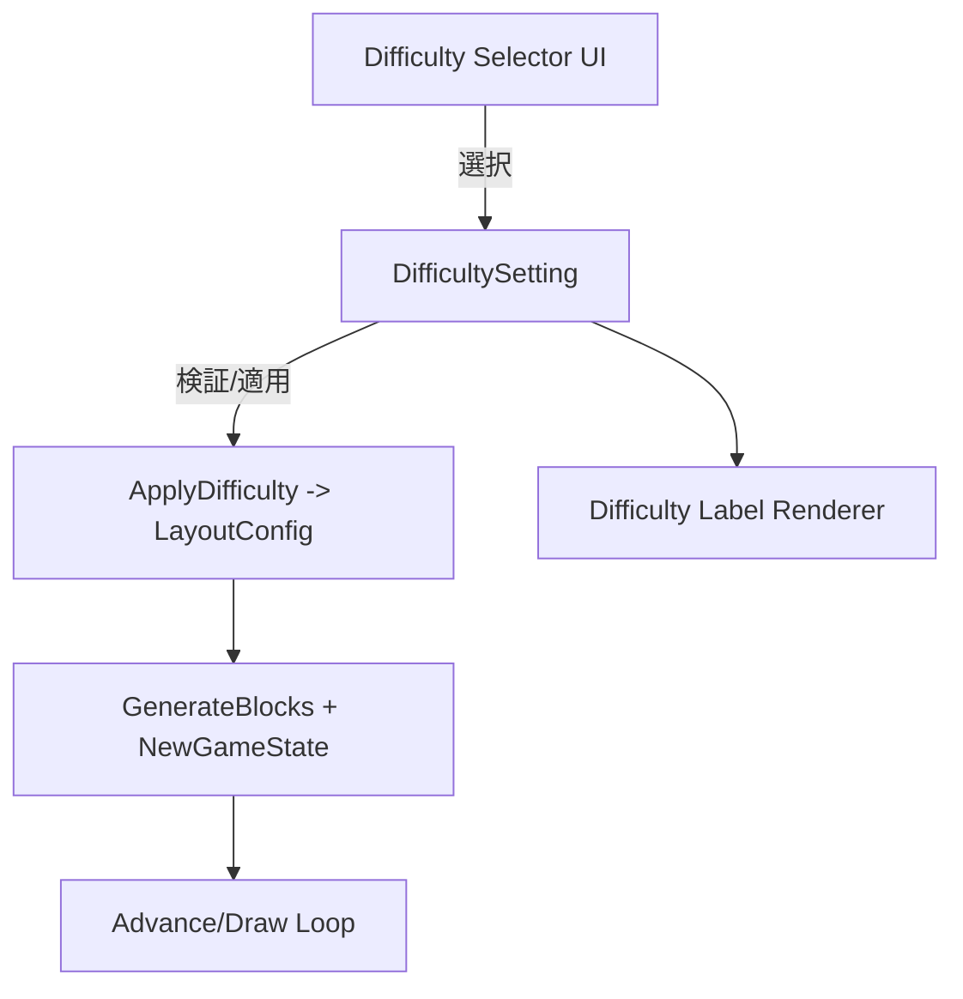
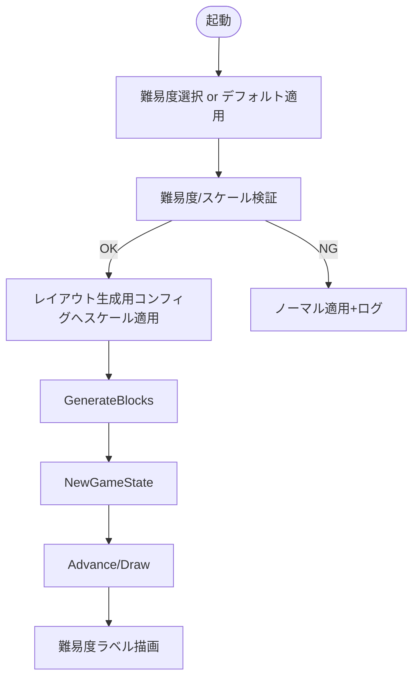

# Design Document

## Overview
この機能ではゲーム開始前に難易度（EASY/NORMAL/HARD）を選択し、選択結果に応じてボール速度・パドル操作性・ブロック/ボールサイズ・ブロック数を調整する。難易度名をゲーム中・ポーズ/リスタート画面で可視化し、無効値はノーマルへフォールバックする。既存のランダム配置ロジックを踏まえ、HARDでのブロック増加・サイズ縮小でも配置が成立するように生成上限と寸法を調整する。

### Goals
- 1.1–1.5: ゲーム開始前に3種の難易度を提示し、未選択時はノーマルを適用、毎回選択可能でUIに明示
- 2.1–2.5: 難易度別にボール速度・パドル幅/速度・ブロック/ボールサイズ・ブロック数を調整し、基準値を保持しつつ差分を適用
- 3.1–3.4: 現在の難易度をゲーム画面・ポーズ/リスタートで表示し、無効値はノーマルへフォールバックして表示
- 4.1–4.4: 難易度設定値を一元管理し、無効値・極端値を起動時に検証してログ出力。テストで決定的に再現できるよう定数化

### Non-Goals
- 新しいグラフィックアセット追加やUIスキン変更
- オーディオや入力デバイス拡張
- スコア計算ルール変更（難易度差分のみ適用）

## Architecture

### Existing Architecture Analysis
- `block-game/pkg/domain`: `LayoutConfig` が画面/オブジェクト寸法・速度・乱数シードを保持し、`NewGameState` で初期ボール・パドルを生成。`GenerateBlocks` がレイアウトを生成し `GameState.Blocks` に渡す。
- `Advance` が入力/物理更新とブロック破壊を処理。`reflectVelocity` でボール速さを維持。
- ランダム配置は `LayoutConfig.BlockW/H/Count` と `MinPaddleGap` に依存。パラメータ変更は `LayoutConfig` を経由するのが安全。

### Architecture Pattern & Boundary Map
- パターン: コンフィグ指向。難易度ごとのスケール定義を `DifficultySetting` に集約し、`ApplyDifficulty(base LayoutConfig, setting DifficultySetting)` で派生コンフィグを生成。ゲームロジックは生成済みコンフィグのみ参照し、難易度判定をロジック層に持ち込まない。
- 境界:
  - Config層: 難易度定義・検証・適用
  - Domain層: `LayoutConfig` と `GameState` の初期化
  - View層: 難易度ラベル描画（既存レンダラに追加）
- 既存パターン維持: `LayoutConfig` に集約、`GenerateBlocks`/`NewGameState`/`Advance` を再利用。

### Technology Stack
| Layer | Choice / Version | Role in Feature | Notes |
|-------|------------------|-----------------|-------|
| Logic / Config | Go 1.24, existing domain | 難易度定義・検証・スケール適用 | 既存構造体に拡張 |
| Random | `math/rand` | 乱数は既存の `RandomSource` を継続 | 変更なし |
| Rendering | Ebitengine v2 | 難易度ラベル表示 | 既存レンダラへ文字描画追加 |

## System Flows

## Requirements Traceability
| Requirement | Summary | Components | Interfaces | Flows |
|-------------|---------|------------|------------|-------|
| 1.1–1.5 | 選択UI・デフォルト・毎回選択・表示 | DifficultySelector, DifficultySetting | ApplyDifficulty API | Start→Select |
| 2.1–2.5 | 速度/幅/サイズ/数の調整 | DifficultySetting, ApplyDifficulty, LayoutConfig | ApplyDifficulty | Select→Apply |
| 3.1–3.4 | ラベル表示とフォールバック表示 | DifficultyLabelRenderer | Renderer API | Init→Label |
| 4.1–4.4 | 検証・ログ・定数管理 | DifficultyValidator | ApplyDifficulty | Select→Validate |

## Components and Interfaces

### コンポーネントサマリ
| Component | Domain/Layer | Intent | Req Coverage | Key Dependencies | Contracts |
|-----------|--------------|--------|--------------|------------------|-----------|
| DifficultySetting (struct/map) | Config | 難易度ごとのスケール定義を一元管理 | 1.x,2.x,4.x | 定数 | State |
| DifficultySelector | UI/Input | 起動時の選択とデフォルト適用 | 1.x | UI input | Service |
| ApplyDifficulty | Config | Base `LayoutConfig` にスケールを適用 | 2.x,4.x | LayoutConfig | Service |
| DifficultyValidator | Config | スケール値・難易度キーの検証とフォールバック | 3.3,4.x | Logger | Service |
| DifficultyLabelRenderer | View | ゲーム/ポーズ/リスタートでラベル描画 | 1.5,3.x | Renderer | Service |

### DifficultySetting / ApplyDifficulty
- フィールド例:
  - `Name string` (EASY/NORMAL/HARD)
  - `BallSpeedScale float64`
  - `BallRadiusScale float64`
  - `PaddleWidthScale float64`
  - `PaddleSpeedScale float64`
  - `BlockSizeScale float64`
  - `BlockCountScale float64`（HARDで>1.0、NORMAL=1.0、EASY=1.0を基本）
- `ApplyDifficulty(base LayoutConfig, s DifficultySetting) (LayoutConfig, error)`
  - `BallSpeed = base.BallSpeed * s.BallSpeedScale`
  - `BallRadius = base.BallRadius * s.BallRadiusScale`
  - `PaddleWidth/Speed = base * scale`
  - `BlockW/H = base * s.BlockSizeScale`
  - `BlockCount = int(math.Round(base.BlockCount * s.BlockCountScale))`（下限1）
  - `BlockRows/Cols` は基準を保持しつつ、BlockCount増加時は `BlockCount` を優先（行列は表示用に残すが生成は BlockCount を使用）
  - `MaxAttempts` は BlockCount に比例して増加（例: `maxAttempts = BlockCount*10`）
  - 生成可能領域チェック: `(maxX*maxY)/(BlockW*BlockH)` 未満ならスケールを再クランプ or エラー
- リスク/競合: 要件2.4で「ブロック数を多くする」一方、2.5で「基本値を維持」。設計判断として「NORMAL/EASYは基本値を維持、HARDは倍率で増加し、基本値を基準として保持」を採用。トレーサビリティで明示し、要件2.5は NORMAL/EASY で満たし、HARDは拡張として扱う。

### DifficultySelector
- 起動時に入力デバイスまたは設定値から難易度を決定。未選択の場合は NORMAL。
- 1ゲームセッションのみ保持し、リスタート時は再選択可（新規セッション開始前にリセット）。

### DifficultyValidator
- 許容範囲:
  - スケールは (0, 10] 程度でクランプ。0以下はエラー。
  - BlockCountScale は上限を配置面積に合わせて `min(requested, capacity)` に丸める。
- 無効値は NORMAL にフォールバックし、エラーをログ（または標準出力）。

### DifficultyLabelRenderer
- 画面左上などに `Difficulty: EASY|NORMAL|HARD` を描画。
- ポーズ/リスタート画面でも同一表示を再利用。

## Data Models
- `Difficulty` 列挙: `EASY`, `NORMAL`, `HARD`
- `DifficultySetting` 構造体（上記フィールド）
- `DifficultyConfig` マップ: `map[Difficulty]DifficultySetting`
- `LayoutConfig` 拡張: `Difficulty Difficulty` を保持し、`ApplyDifficulty` 後の値を使用。`BlockCount` を生成に使用。

## Error Handling
- 未知の難易度 → NORMAL にフォールバック + ログ
- スケール0以下・過大 → 検証時にエラー。UIは選択を拒否、または NORMAL 適用。
- HARD で配置不能（面積不足/試行上限超過） → `GenerateBlocks` エラーを捕捉し、グリッドフォールバック or ノーマル設定で再生成を選択可能とする（実装で方針を決める）。

## Testing Strategy
- 単体:
  - `ApplyDifficulty` が各スケールを正しく適用し、境界チェックでクランプされる
  - 無効難易度・無効スケールが NORMAL にフォールバックする
  - HARD で BlockCount 増加時に `MaxAttempts` が比例し、BlockSize 縮小で配置領域内に収まる
- 統合:
  - 難易度選択→`GenerateBlocks`→`NewGameState` の初期化で速度/寸法/数が適用される
  - ラベル描画に現在の難易度が出る（ポーズ/リスタート含む）
- 回帰:
  - NORMAL 選択時は既存のデフォルト値とプレイフィールが維持される

## Performance & Scalability (feature-specific)
- HARD で BlockCount 増加に伴い `MaxAttempts` を比例させ、配置失敗を防ぐ。増加幅は画面面積に基づき上限を設けるため計算量は O(N * attempts) を維持。

