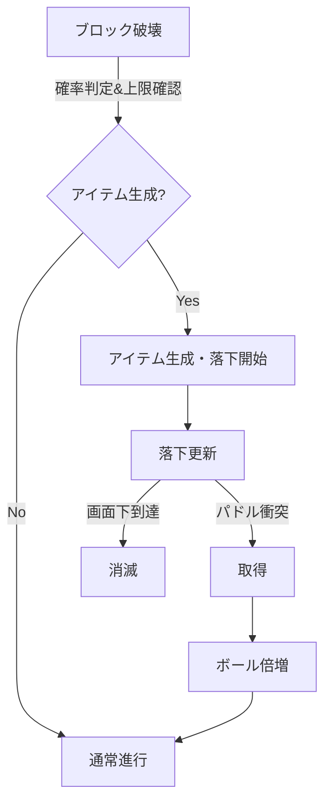

# Design Document

## Overview
本機能は、ブロック破壊時に一定確率でアイテムを落下させ、パドル取得で場のボール数を倍増させるマルチボール効果を追加する。プレイヤーにランダム性と一時的なハイテンション状態を提供し、既存ゲームループ（Update/Draw）と整合する軽量な拡張とする。影響範囲はゲーム状態管理と衝突判定、描画の最小追加に限定する。

### Goals
- ドロップ率・同時生成上限を持つアイテム生成を実装する
- パドル取得でボール数を倍増し、上限内で速度分岐を付与する
- 未取得アイテムは自然消滅させ、ゲームバランスとパフォーマンスを維持する

### Non-Goals
- 新しいスコア計算やライフ制御の導入（既存挙動を継続）
- 追加のパワーアップ種別やUI表示（本機能では実装しない）
- 永続化や設定ファイル化の強制（定数で管理、将来拡張に備える）

## Architecture

### Existing Architecture Analysis
- Ebitenベースのゲームループで `Update` が状態更新・衝突判定、`Draw` が描画を担当。
- `GameUsecase` がゲーム状態（ボール、ブロック、パドル）を保持・更新するアプリケーション層。インフラ層は入力とレンダリングを担う。
- 既存のAABB衝突ロジックと速度ベクトル更新を流用し、一貫性を保つ。

### Architecture Pattern & Boundary Map
- Selected pattern: 単一ゲームループ内の状態管理（モノリシック、レイヤード）。追加要素も `GameUsecase` 管理下に置く。
- Domain/feature boundaries: アイテムとボール管理をアプリケーション層に集約し、インフラ層は描画・入力のみを拡張（新たな外部依存なし）。
- Existing patterns preserved: AABB衝突、速度ベクトルによる反射・更新、定数管理。
- New components rationale: ItemエンティティとDrop/Applyロジックを追加し、ボール複製処理をカプセル化して再利用性を確保。
- Steering compliance: 単純構造・定数管理・Ebitenループの原則を維持。

### Technology Stack

| Layer | Choice / Version | Role in Feature | Notes |
|-------|------------------|-----------------|-------|
| Frontend / CLI | Ebiten v2 | 描画と入力 | 既存レンダラにアイテム描画を追加 |
| Backend / Services | GameUsecase (Go) | 状態更新・衝突判定 | アイテム生成/落下/取得とマルチボール処理を実装 |
| Data / Storage | In-memory structs | 一時状態 | 永続化なし |
| Messaging / Events | なし | - | - |
| Infrastructure / Runtime | Go 1.24 + Ebiten loop | 実行基盤 | 既存と同一 |

## System Flows

取得時のみ倍増処理を発火し、消滅・上限で過剰生成を抑制する。

## Requirements Traceability

| Requirement | Summary | Components | Interfaces | Flows |
|-------------|---------|------------|------------|-------|
| 1 | ドロップ率と上限付きアイテム生成 | GameUsecase.Drop | Update loop | System Flows |
| 2 | アイテム落下・取得判定 | GameUsecase.UpdateItems, Collision | Update loop | System Flows |
| 3 | マルチボール倍増 | GameUsecase.ApplyMultiball | Update loop | System Flows |
| 4 | 状態リセット/上限管理 | GameUsecase.Reset / caps | Update loop | System Flows |

## Components and Interfaces

| Component | Domain/Layer | Intent | Req Coverage | Key Dependencies (P0/P1) | Contracts |
|-----------|--------------|--------|--------------|--------------------------|-----------|
| Item | Domain | 落下アイテムの状態保持 | 1,2 | Math (P0), AABB (P0) | State |
| GameUsecase.Drop | Application | ブロック破壊時の生成判定と生成 | 1 | RNG/const (P0) | State |
| GameUsecase.UpdateItems | Application | アイテム落下と衝突・消滅処理 | 2 | Paddle state (P0), AABB (P0) | State |
| GameUsecase.ApplyMultiball | Application | 取得時のボール複製・上限制御 | 3 | Ball list (P0) | State |
| Reset/Init hooks | Application | 新ラウンド/ゲーム開始時の初期化 | 4 | Existing init (P0) | State |

### Domain

#### Item
| Field | Detail |
|-------|--------|
| Intent | 落下中アイテムの位置・速度・存否を管理 |
| Requirements | 1,2 |

**Responsibilities & Constraints**
- 位置・サイズ（AABB用）、落下速度、存続フラグを保持。
- 同時存在上限を超えない生成を保証。
- 画面外到達で自動消滅。

**Dependencies**
- Inbound: GameUsecase.UpdateItems — 位置更新と衝突判定
- Outbound: なし（自前状態のみ）
- External: math/rand — ドロップ確率

**Contracts**: State [x]

### Application

#### GameUsecase.Drop
| Field | Detail |
|-------|--------|
| Intent | ブロック破壊イベントからアイテム生成を決定・生成 |
| Requirements | 1 |

**Responsibilities & Constraints**
- 確率判定（例:10%）と上限チェックを行い生成。
- 生成位置を破壊ブロック中心に設定し、初期速度を定数で付与。
- ドロップ率・上限・初速を定数で管理（将来設定化可能な形に）。

**Contracts**: State [x]

#### GameUsecase.UpdateItems
| Field | Detail |
|-------|--------|
| Intent | 毎フレームの落下更新とパドル衝突/画面外判定 |
| Requirements | 2 |

**Responsibilities & Constraints**
- Y座標を毎フレーム更新（一定速度または重力加速を定数化）。
- パドルとのAABB衝突で取得→対象アイテム削除→ApplyMultiball呼び出し。
- 画面下端到達で削除。複数アイテムを独立に更新。

**Contracts**: State [x]

#### GameUsecase.ApplyMultiball
| Field | Detail |
|-------|--------|
| Intent | 取得時にボールを複製し上限内で2倍化 |
| Requirements | 3 |

**Responsibilities & Constraints**
- 現在のボール配列を複製し合計を2倍化、最大上限（例:8個）でクリップ。
- 新規ボールは元速度を基に左右反転・少量の角度分岐を与える（定数で分岐数を管理）。
- 複製元位置を初期位置とし、効果発動アイテムを確実に消去。

**Contracts**: State [x]

#### Reset/Init hooks
| Field | Detail |
|-------|--------|
| Intent | ゲーム開始/ラウンド開始時のボール数・アイテムクリア |
| Requirements | 4 |

**Responsibilities & Constraints**
- 新規開始時にボール配列を1個に再初期化、アイテムリストを空にする。
- 全ボール喪失時の既存リセット処理と連動し、マルチボール状態を整理。

**Contracts**: State [x]

## Data Models

### Domain Model
- Item: `{x, y, width, height, vy, active}`。AABB用の幅高は定数化。vyは初速/重力で更新。
- Ball: 既存 `{x, y, vx, vy, radius}` を拡張せず、複製時に速度ベクトル分岐のみ付与。最大数 `maxBalls` を追加。
- Game state: `items []Item` を追加。`balls []Ball` は可変長で上限管理。

### Logical Data Model
- アイテム生成はブロック破壊イベント起点。ID不要、リスト上のインデックスで管理。
- 整合性: `len(items) <= maxItems`; `1 <= len(balls) <= maxBalls` を不変条件とする。

## Error Handling

### Error Strategy
- 上限超過: 生成/複製前にクリップし、状態を変えない or 上限まで生成。
- 速度分岐のゼロ除算やNaNは避け、定数で分岐方向を持つ。
- 衝突判定はAABBで例外なく処理し、nil参照が生じないよう空スライスで初期化。

### Monitoring
- デバッグログ（任意）で生成/取得/倍増発火をトレース可能にする（開発時のみ）。

## Testing Strategy
- Unit: ドロップ判定（確率と上限）、落下更新での位置/消滅判定、AABB衝突での取得フラグ、複製時の上限クリップと速度分岐。
- Integration: ブロック破壊→生成→落下→取得→倍増までの一連フロー、全ボール喪失時のリセットと整合性。
- (任意) E2E: アイテム取得で画面上のボール数が増えることの目視/スナップショット確認。

