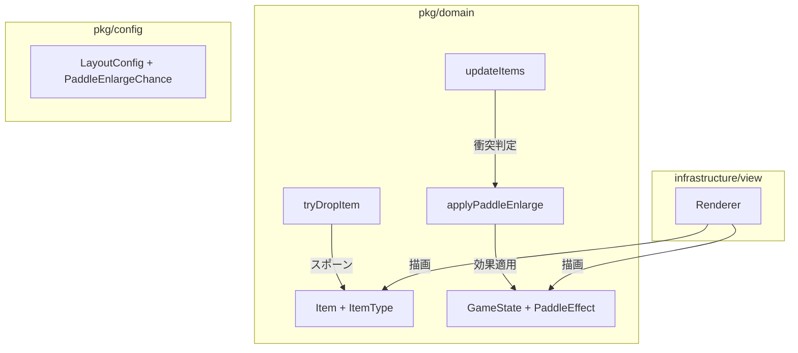
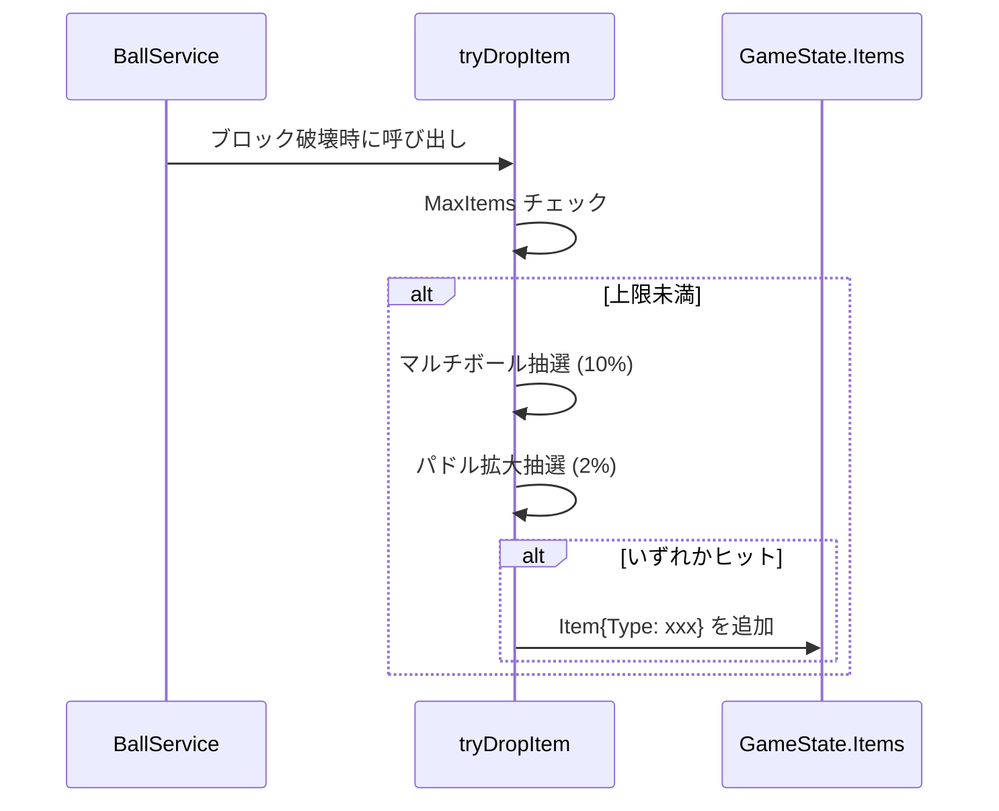
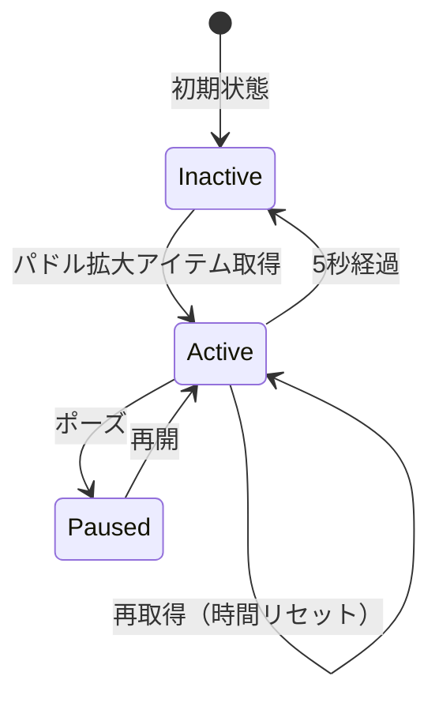
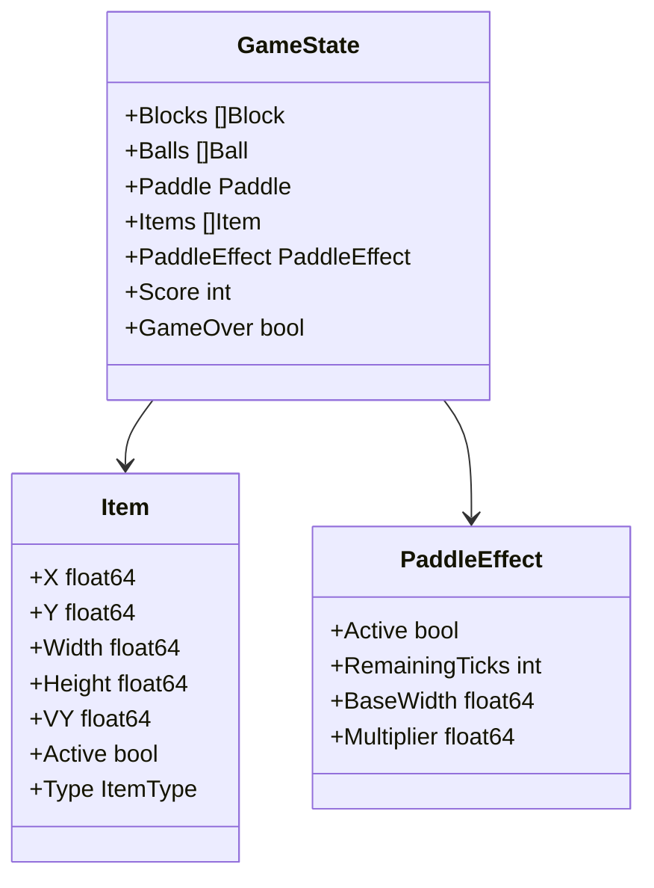

# Design Document

## Overview
**Purpose**: パドル拡大アイテムにより、プレイヤーに一時的な救済チャンスを提供し、ゲームプレイの幅を広げる。
**Users**: プレイヤーがブロック破壊時に2%確率で出現するアイテムを取得し、5秒間パドル幅3倍の恩恵を受ける。
**Impact**: 既存アイテムシステム（マルチボール）にアイテム種別と時限効果管理を追加する。

### Goals
- ブロック破壊時に2%確率でパドル拡大アイテムをスポーン
- 取得時にパドル幅を3倍にし、5秒後に元に戻す
- マルチボールアイテムと視覚的・論理的に区別可能にする

### Non-Goals
- 効果の重ね掛け（3倍を超える拡大）
- 他の時限効果（スピードアップ等）の追加
- アイテム種別のランダム選択確率の外部設定化（将来検討）

## Architecture

### Existing Architecture Analysis
- **Item 構造体**: 現状は種別フィールドなし（全てマルチボール扱い）
- **updateItems**: パドル衝突時に `applyMultiball` を直接呼び出し
- **tryDropItem**: `ItemDropChance`（10%）で単一種のみスポーン
- **GameState**: 時限効果の状態管理なし

### Architecture Pattern & Boundary Map



**Architecture Integration**:
- 選択パターン: 既存ドメイン拡張（新規レイヤーなし）
- ドメイン境界: `Item` に `Type` フィールド追加、`GameState` に効果状態追加
- 既存パターン維持: `tryDropItem` / `updateItems` の構造を踏襲
- 新規コンポーネント: `PaddleEffect` 構造体、`applyPaddleEnlarge` 関数

### Technology Stack

| Layer | Choice / Version | Role in Feature | Notes |
|-------|------------------|-----------------|-------|
| Domain | Go (pkg/domain) | アイテム種別・効果ロジック | 既存拡張 |
| Config | Go (pkg/config) | ドロップ確率・効果パラメータ | 定数追加 |
| View | Ebiten (infrastructure/view) | アイテム・パドル描画 | 色分け対応 |

## System Flows

### アイテムドロップフロー



### 効果適用フロー



## Requirements Traceability

| Requirement | Summary | Components | Interfaces | Flows |
|-------------|---------|------------|------------|-------|
| 1.1 | 2%確率でスポーン | tryDropItem | LayoutConfig.PaddleEnlargeChance | ドロップフロー |
| 1.2 | ブロック位置から落下 | tryDropItem | Item | ドロップフロー |
| 1.3-1.5 | 落下・消去・上限 | updateItems | Item, LayoutConfig | - |
| 2.1 | 取得時3倍・5秒 | applyPaddleEnlarge | PaddleEffect | 効果適用フロー |
| 2.2-2.4 | 効果維持・リセット・終了 | updatePaddleEffect | PaddleEffect | 効果適用フロー |
| 2.5 | ポーズ中停止 | Advance | PaddleEffect | 効果適用フロー |
| 3.1 | アイテム色分け | Renderer | Item.Type | - |
| 3.2-3.3 | 効果インジケータ | Renderer | PaddleEffect | - |

## Components and Interfaces

| Component | Domain/Layer | Intent | Req Coverage | Key Dependencies | Contracts |
|-----------|--------------|--------|--------------|------------------|-----------|
| Item | domain | アイテムデータ | 1.1-1.5 | LayoutConfig | State |
| PaddleEffect | domain | 時限効果状態 | 2.1-2.5 | - | State |
| tryDropItem | domain | スポーン判定 | 1.1, 1.2, 1.5 | RandomSource | Service |
| updateItems | domain | 落下・衝突処理 | 1.3, 1.4, 2.1 | GameState | Service |
| applyPaddleEnlarge | domain | 効果開始 | 2.1-2.3 | PaddleEffect | Service |
| updatePaddleEffect | domain | 効果時間管理 | 2.4, 2.5 | PaddleEffect | Service |
| Renderer | view | 描画 | 3.1-3.3 | Item, PaddleEffect | - |

### Domain

#### Item（拡張）

| Field | Detail |
|-------|--------|
| Intent | 落下アイテムの種別を識別可能にする |
| Requirements | 1.1, 1.2, 3.1 |

**変更内容**

```go
type ItemType int

const (
    ItemTypeMultiball ItemType = iota
    ItemTypePaddleEnlarge
)

type Item struct {
    X, Y   float64
    Width  float64
    Height float64
    VY     float64
    Active bool
    Type   ItemType // 追加
}
```

#### PaddleEffect（新規）

| Field | Detail |
|-------|--------|
| Intent | パドル拡大効果の状態を管理 |
| Requirements | 2.1-2.5 |

```go
type PaddleEffect struct {
    Active        bool
    RemainingTicks int     // 60FPS 想定: 5秒 = 300 ticks
    BaseWidth     float64  // 効果適用前の幅
    Multiplier    float64  // 3.0
}
```

**Invariants**:
- `Active == true` のとき `RemainingTicks > 0`
- `Multiplier` は定数 3.0（設定変更は将来検討）

#### tryDropItem（拡張）

```go
func tryDropItem(state *GameState, cfg LayoutConfig, block *Block, rnd RandomSource) {
    if len(state.Items) >= cfg.MaxItems {
        return
    }
    // マルチボール抽選
    if rnd.Float64() < cfg.ItemDropChance {
        spawnItem(state, cfg, block, ItemTypeMultiball)
    }
    // パドル拡大抽選（独立）
    if rnd.Float64() < cfg.PaddleEnlargeChance {
        spawnItem(state, cfg, block, ItemTypePaddleEnlarge)
    }
}
```

#### applyPaddleEnlarge（新規）

```go
func applyPaddleEnlarge(state *GameState, cfg LayoutConfig) {
    effect := &state.PaddleEffect
    if !effect.Active {
        effect.BaseWidth = state.Paddle.Width
        effect.Multiplier = 3.0
        state.Paddle.Width = effect.BaseWidth * effect.Multiplier
    }
    effect.Active = true
    effect.RemainingTicks = 300 // 5秒 @ 60FPS
}
```

#### updatePaddleEffect（新規）

```go
func updatePaddleEffect(state *GameState) {
    effect := &state.PaddleEffect
    if !effect.Active {
        return
    }
    effect.RemainingTicks--
    if effect.RemainingTicks <= 0 {
        state.Paddle.Width = effect.BaseWidth
        effect.Active = false
    }
}
```

## Data Models

### Domain Model



### Config 追加

```go
// pkg/config/layout.go
const (
    PaddleEnlargeChance   = 0.02  // 2%
    PaddleEnlargeDuration = 300   // 5秒 @ 60FPS
    PaddleEnlargeMultiplier = 3.0
)
```

## Error Handling

- **上限到達**: `MaxItems` 超過時は静かにスキップ（既存挙動踏襲）
- **効果重複**: 再取得時はタイマーリセットのみ、幅は維持（要件 2.3）
- **ポーズ中**: `Advance` がスキップされるため自動的に効果時間が停止

## Testing Strategy

### Unit Tests
- `tryDropItem`: 2%確率でパドル拡大アイテムがスポーンすること
- `applyPaddleEnlarge`: 幅が3倍になり、`Active=true`、`RemainingTicks=300` になること
- `updatePaddleEffect`: 300 ticks 後に幅が元に戻り `Active=false` になること
- 再取得時にタイマーがリセットされ幅が変わらないこと

### Integration Tests
- ブロック破壊 → アイテムスポーン → 取得 → 効果適用 → 時間経過 → 効果終了 の一連フロー
- マルチボールとパドル拡大が同時スポーン可能であること

