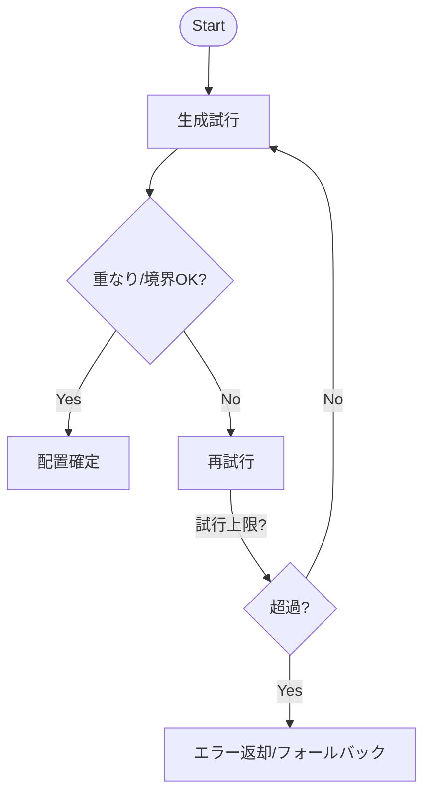

# Design Document

## Overview
この機能はブロック崩しゲームの初期配置を固定グリッドからランダム配置に切り替え、プレイごとに変化のある体験を提供する。プレイヤーは異なるブロック配置に対応する必要があり、リプレイ性が向上する。

### Goals
- 1.1–1.5: ランダム配置で毎回異なるパターンを生成し、画面内に収める
- 2.1–2.3: パドルとの最小Y距離を確保し、足りない場合は再配置
- 3.1–3.2: ブロック総数（行×列）を維持し、重なりを排除
- 4.1–4.3: 標準乱数を用い、シード管理で再現性オプションを提供

### Non-Goals
- ブロック形状やサイズの変更
- ボール／パドルの物理挙動変更
- 既存UI（描画）変更

## Architecture

### Existing Architecture Analysis
- モノリシック構造 (`main.go`)。`Game` が状態を保持し、`Update`/`Draw` で進行。
- 現行 `initBlocks` は規則的グリッド生成のみ。乱数・重なり判定・距離制約なし。

### Architecture Pattern & Boundary Map
- パターン: 単純な関数分離＋コンフィグ注入。生成ロジックを純粋関数に分離し、`initBlocks` から呼び出すハイブリッド。
- 境界: レイアウト生成（純粋関数）とゲーム状態保持（Game struct）を分離。
- 既存パターン維持: Ebitengineの`Update/Draw`ループと単一ファイル構造を維持。

```mermaid
graph TB
    GameInit[Game initBlocks] --> Generator[BlockLayoutGenerator]
    Generator --> Config[LayoutConfig]
    Generator --> Rand[RandomSource]
    Generator --> Blocks[[]Block]
    Blocks --> GameState[Game State]
```

### Technology Stack
| Layer | Choice / Version | Role in Feature | Notes |
|-------|------------------|-----------------|-------|
| Backend / Services | Go 1.24 + Ebitengine v2 | ゲームループと描画基盤 | 既存継続 |
| Logic | 標準 `math/rand` | 乱数生成・シード管理 | 新たな依存なし |
| Runtime | Go 標準 | 実行環境 | 変更なし |

## System Flows

- キー決定: 上限超過時はエラーを返し、呼び出し側で再シードやデフォルト配置にフォールバック可能にする。

## Requirements Traceability
| Requirement | Summary | Components | Interfaces | Flows |
|-------------|---------|------------|------------|-------|
| 1.1–1.5 | ランダム配置・重なり回避・画面内収容 | BlockLayoutGenerator, LayoutConfig | GenerateBlocks API, RandomSource | 生成フロー |
| 2.1–2.3 | パドルとの最小Y距離確保 | BlockLayoutGenerator, LayoutConfig | GenerateBlocks API | 生成フロー |
| 3.1–3.2 | ブロック総数維持 | BlockLayoutGenerator | GenerateBlocks API | 生成フロー |
| 4.1–4.3 | 乱数・シード管理 | RandomSource | RandomSource interface | 生成フロー |

## Components and Interfaces

### コンポーネントサマリ
| Component | Domain/Layer | Intent | Req Coverage | Key Dependencies (P0/P1) | Contracts |
|-----------|--------------|--------|--------------|--------------------------|-----------|
| BlockLayoutGenerator | Logic | 制約を満たすブロック座標を生成 | 1.1-1.5,2.1-2.3,3.1-3.2,4.1-4.3 | math/rand (P1), LayoutConfig (P0) | Service |
| LayoutConfig | Config/State | 画面・ブロック・距離・試行上限の設定保持 | 1.4,2.1-2.4,3.1 | Game constants (P0) | State |
| RandomSource | Infra | 乱数とシード管理の抽象化 | 4.1-4.3 | math/rand (P0) | Service |
| RetryLimiter | Logic | 試行回数の上限管理 | 1.3,1.4,2.3 | LayoutConfig (P0) | State |

### Logic

#### BlockLayoutGenerator
| Field | Detail |
|-------|--------|
| Intent | 制約を満たすブロック配置を生成する純粋関数 |
| Requirements | 1.1,1.2,1.3,1.4,1.5,2.1,2.2,2.3,3.1,3.2,4.1,4.2,4.3 |

**Responsibilities & Constraints**
- 画面境界内に配置（左右・上下を考慮）
- ブロック同士のAABB重なり禁止
- パドルYから `minPaddleGap` 以上離す
- 試行上限 `maxAttempts` 超過でエラー返却

**Dependencies**
- Inbound: `LayoutConfig` — 画面・サイズ・ギャップ・試行上限（P0）
- Inbound: `RandomSource` — 乱数生成とシード（P0）
- Outbound/External: なし

**Contracts**: Service [x] / State [ ] / API [ ] / Event [ ] / Batch [ ]

##### Service Interface (Go想定)
```go
type LayoutConfig struct {
    ScreenW, ScreenH    float64
    BlockW, BlockH      float64
    BlockCount          int
    MinPaddleGap        float64
    PaddleY             float64
    MaxAttempts         int
    Seed                *int64 // nil の場合は現在時刻で初期化
}

type RandomSource interface {
    Float64() float64
    Intn(n int) int
    Seed(seed int64)
}

type Block struct {
    X, Y   float64
    Alive  bool
}

func GenerateBlocks(cfg LayoutConfig, rnd RandomSource) ([]Block, error)
```
- Preconditions: `BlockCount > 0`, `MaxAttempts > BlockCount`, `MinPaddleGap > 0`
- Postconditions: 返却ブロック数=BlockCount、全て境界内、重なりなし、`Y <= PaddleY - MinPaddleGap`
- Invariants: `Alive` は初期化時すべて true

**Implementation Notes**
- Integration: `initBlocks` で `LayoutConfig` を構築し、`GenerateBlocks` を呼び出して結果を `g.blocks` に設定
- Validation: 入力検証で不正値を早期エラーにする
- Risks: 試行上限超過時のエラー伝播とフォールバック（再シード or 既存グリッド）を呼び出し側で決定

#### RandomSource
| Field | Detail |
|-------|--------|
| Intent | 乱数生成を抽象化しシード管理を可能にする |
| Requirements | 4.1,4.2,4.3 |

**Responsibilities & Constraints**
- `math/rand.Rand` をラップし、任意シード設定を許容
- スレッドセーフ要件なし（初期化時のみ使用）

**Dependencies**
- External: `math/rand`（P0）

**Contracts**: Service [x] / State [ ] / API [ ] / Event [ ] / Batch [ ]

**Implementation Notes**
- Integration: `Seed` を指定すると再現性のある配置を生成できる
- Risks: シード未指定時は非決定的、テストでは固定シードを使用

### Config/State

#### LayoutConfig / RetryLimiter
| Field | Detail |
|-------|--------|
| Intent | 配置制約と試行上限の設定を一元管理 |
| Requirements | 1.3,1.4,2.1,2.2,2.3,3.1 |

**Responsibilities & Constraints**
- `MaxAttempts` を超えたらエラーを返すポリシーを定義
- `MinPaddleGap` に基づき配置を拒否・再試行

**Dependencies**
- Inbound: 定数（画面サイズ、パドル位置）
- Outbound: BlockLayoutGenerator（P0）

**Contracts**: State [x]

## Data Models
- `LayoutConfig`: 画面サイズ、ブロックサイズ、総数、最小ギャップ、パドルY、試行上限、シード
- `Block`: 既存構造体を継続（X, Y, Alive）
- `RandomSource`: 乱数生成の抽象化インタフェース

## Error Handling
- 不正入力（負のサイズ、ゼロ試行上限）: 生成前に即エラー
- 配置失敗（上限超過）: エラーを返却し、呼び出し側でフォールバックを選択
- シード設定エラー: `Seed` が nil の場合は現在時刻を使用（エラーにしない）

## Testing Strategy
- Unit: 
  - 重なりなしを検証（全ペアでAABB不交差）
  - 画面境界内を検証（X/Yが0以上、幅高内）
  - `MinPaddleGap` を満たすことを検証
  - 固定シードで決定的な配置が再現されることを検証
  - 試行上限超過時にエラーを返すことを検証
- Integration:
  - `initBlocks` 経由で生成し、ブロック総数と距離制約が保たれることを確認
- Performance: 小規模のため計測不要（試行上限で制御）

## Optional Sections
### Security Considerations
- 外部サービス・機密データなし。追加リスクなし。

### Performance & Scalability
- 試行上限により計算量を O(N * attempts) に制限。N=50、attempts=最大500程度で許容。

## Supporting References
- 主要な判断と契約は本ドキュメントに記載。補足調査は `research.md` を参照。

