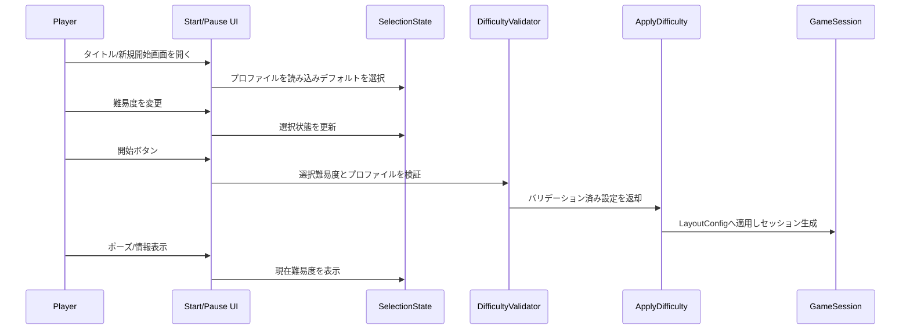

# Design Document

## Overview
本機能はゲーム開始前にUI上で難易度を選択させ、選択結果をゲーム設定へ確実に反映・表示することでプレイヤー体験を最適化する。対象はタイトル画面/新規開始フローおよびプレイ中の確認UI（ポーズ等）であり、既存の難易度スケール適用ロジックを安全に活用する。
ユーザーは開始前に難易度を切り替え、開始時に選択値が渡された状態でゲームが生成・進行する。表示・入力はキーボード/マウス双方を想定し、デフォルト選択を常に維持して開始不可状態を回避する。

### Goals
- タイトル/開始UIでEASY/NORMAL/HARDを最低3種提示し、デフォルトを自動選択表示する。
- 選択された難易度を検証・適用して初期レイアウト設定に反映する。
- ポーズ/情報表示で現在の難易度と概要を確認できる。

### Non-Goals
- 難易度の動的追加・編集UI（将来拡張とする）。
- サーバー保存やアカウント同期（ローカル設定のみ）。
- ゲーム進行中の難易度再選択（開始前限定）。

## Architecture

### Existing Architecture Analysis
- ドメイン層に `DifficultyProfile`/`DifficultyValidator`/`ApplyDifficulty` が存在し、EASY/NORMAL/HARDのスケールを `LayoutConfig` に適用する。
- デフォルトは NORMAL、未知の選択やスケール不正はバリデータでデフォルトへフォールバックする設計。
- UI側は開始前に難易度を渡し、ゲームセッション生成時に設定を受け取る想定。永続化は行っていない。

### Architecture Pattern & Boundary Map
- パターン: クライアント内UIステート + ドメインサービス適用（バリデータ→適用関数）。  
- 境界: UI選択/表示とドメイン設定適用を分離し、UIは `DifficultyProfile` と検証結果のみを扱う。  
- 新規コンポーネント: 選択UI、選択ステート管理、ポーズ表示。ドメインロジックは既存を再利用。  
- 既存パターン保持: スケール検証・Clamp処理は `DifficultyValidator` に集約。  
- ステアリング遵守: 単一責任、デフォルトフォールバックの堅牢性を維持。

### Technology Stack
| Layer | Choice / Version | Role in Feature | Notes |
|-------|------------------|-----------------|-------|
| Frontend / UI | Go製ゲームクライアント（既存UIフレーム） | 難易度選択・表示 | キーボード/マウス入力対応 |
| Backend / Services | なし（ローカルのみ） | - | - |
| Data / Storage | なし（メモリ内設定） | - | 必要なら後続で保存拡張 |
| Infrastructure / Runtime | Go runtime | 実行基盤 | 既存と同一 |

## System Flows

## Requirements Traceability
| Requirement | Summary | Components | Interfaces | Flows |
|-------------|---------|------------|------------|-------|
| 1 | UIで難易度提示・選択 | DifficultySelectionUI, SelectionState | UIイベント/状態 | Flow steps 1-7 |
| 2 | 選択結果の反映・表示 | ApplyDifficulty, PauseInfoPanel | Domain関数/表示 | Flow steps 7-10 |

## Components and Interfaces
- 概要表
  | Component | Domain/Layer | Intent | Req Coverage | Key Dependencies | Contracts |
  |-----------|--------------|--------|--------------|------------------|-----------|
  | DifficultySelectionUI | UI | 難易度の表示・入力・開始トリガ | 1 | SelectionState (P0), DifficultyProfile (P0) | UI State |
  | SelectionState | UI/State | 選択値・デフォルト保持、開始時に検証呼び出し | 1,2 | DifficultyValidator (P0) | State/Service |
  | DifficultyValidator (既存) | Domain | 未知/不正入力のフォールバックとClamp | 1,2 | DifficultyProfile (P0) | Service |
  | ApplyDifficulty (既存) | Domain | LayoutConfigへスケール適用 | 2 | LayoutConfig (P0) | Service |
  | PauseInfoPanel | UI | 現在難易度と説明の表示 | 2 | SelectionState (P1) | UI State |

### SelectionState
| Field | Detail |
|-------|--------|
| Intent | 選択中の難易度とデフォルトを管理し、開始時にドメイン検証を仲介する |
| Requirements | 1, 2 |

**Responsibilities & Constraints**
- `DifficultyProfile` からデフォルトを初期化し、常に何らかの選択を保持する。
- 開始時に `DifficultyValidator.Validate(profile, selected)` を呼び、結果をゲーム生成に渡す。
- UI入力を受けて選択を更新し、未選択状態を許容しない（デフォルト再適用）。

**Dependencies**
- Inbound: UIイベント（選択変更/開始押下）— 選択更新と検証呼び出し（Critical）
- Outbound: `DifficultyValidator` — 検証・フォールバック（Critical）
- Outbound: `ApplyDifficulty` — LayoutConfig生成（Critical）

**Contracts**: Service [x] / API [ ] / Event [ ] / Batch [ ] / State [x]

**Implementation Notes**
- 未知値は UI 側でも選択肢制限で防ぎつつ、検証失敗時はデフォルトへフォールバックしてユーザーに現在値を表示する。
- 選択値はゲーム開始引数として渡すのみ（永続化なし）。

## Data Models
- 既存 `DifficultyProfile`/`DifficultySetting`/`Difficulty` をそのまま使用。新規永続化なし。
- `SelectionState` はメモリ内で `current: Difficulty`, `default: Difficulty` を保持し、開始時に検証済み設定を `LayoutConfig` へ適用する。

## Error Handling
- 未知難易度/不正スケール: `DifficultyValidator` がデフォルトへフォールバックし、UIは現在難易度を表示して開始を継続。
- 入力欠落: UIがデフォルトを自動選択し開始不可状態を作らない。
- 適用失敗（スケール非正）：UIにエラー表示し再選択を促す（設計上スケールはテンプレート定義で防止）。

## Testing Strategy
- Unit Tests: `SelectionState` のデフォルト初期化と再選択、 `DifficultyValidator.Validate` のフォールバック確認、 `ApplyDifficulty` のスケール適用。
- Integration Tests: UI選択→開始→ゲーム生成までの連携、ポーズ画面での難易度表示。
- E2E/UI Tests: タイトル画面でデフォルト選択表示、難易度変更と開始、キーボード/マウス両操作の確認。
- Performance: 選択UI表示と開始時適用は低負荷想定のため特別な負荷試験は不要（起動時間の劣化がないことを確認）。

